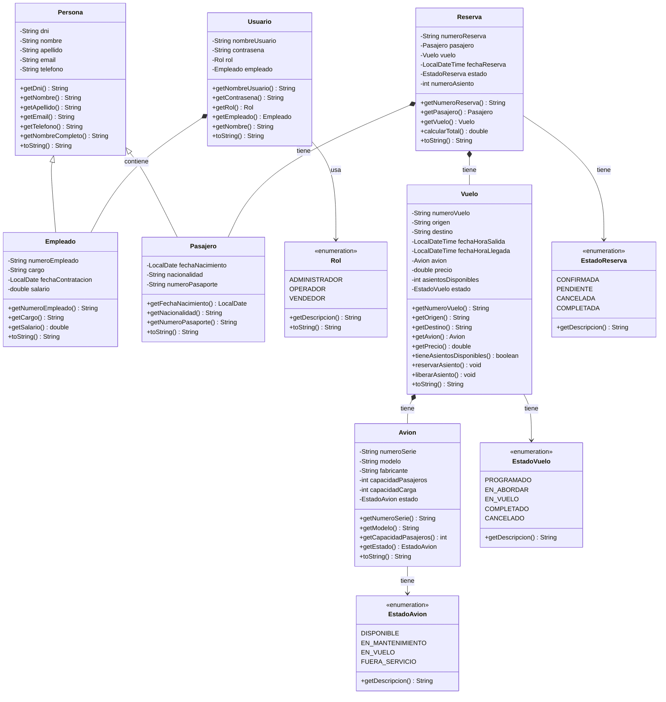
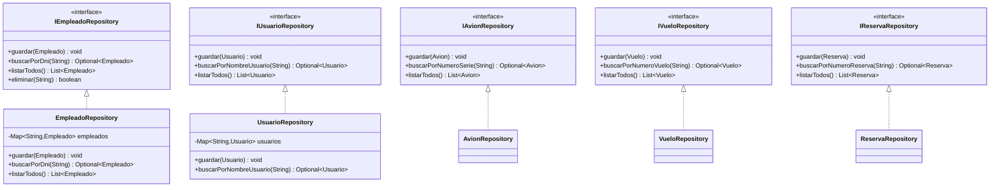
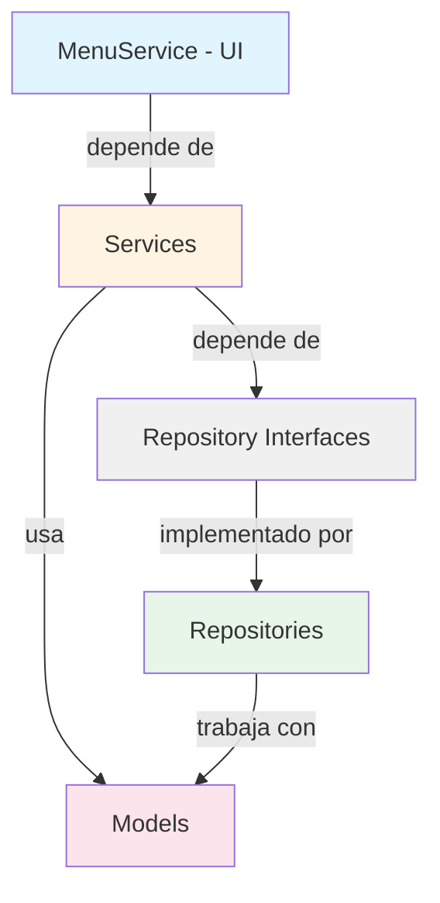

# Diagrama de Clases - Sistema de Gestión de Vuelos

## 📋 Índice
1. [Diagrama de Clases Principal](#diagrama-de-clases-principal)
2. [Diagrama de Clases del Modelo](#diagrama-de-clases-del-modelo)
3. [Diagrama de Clases de Servicios](#diagrama-de-clases-de-servicios)
4. [Diagrama de Clases de Repositorios](#diagrama-de-clases-de-repositorios)
5. [Descripción Detallada de Clases](#descripción-detallada-de-clases)
6. [Relaciones entre Clases](#relaciones-entre-clases)

---

## 📊 Diagrama de Clases Principal

### Diagrama en Mermaid



---

## 🏗️ Diagrama de Clases del Modelo

### Versión en Formato Texto

```
┌─────────────────────────────────────────────────────────────┐
│                          Persona                            │
│  ────────────────────────────────────────────────────────  │
│  - dni: String                                             │
│  - nombre: String                                          │
│  - apellido: String                                        │
│  - email: String                                           │
│  - telefono: String                                        │
│  ────────────────────────────────────────────────────────  │
│  + getDni(): String                                        │
│  + getNombre(): String                                     │
│  + getApellido(): String                                   │
│  + getNombreCompleto(): String                             │
│  + toString(): String                                      │
└─────────────────────────────────────────────────────────────┘
           ▲                            ▲
           │                            │
           │ (extends)                  │ (extends)
           │                            │
┌──────────┴──────────┐    ┌──────────┴──────────┐
│      Empleado       │    │      Pasajero       │
│ ─────────────────── │    │ ─────────────────── │
│ - numeroEmpleado    │    │ - fechaNacimiento  │
│ - cargo             │    │ - nacionalidad     │
│ - fechaContratacion │    │ - numeroPasaporte  │
│ - salario           │    └────────────────────┘
└──────────┬──────────┘
           │
           │ (composición)
           │
    ┌──────▼──────┐      ┌──────┐
    │   Usuario   │───→  │  Rol  │
    │ ────────── │      │(Enum) │
    │ - nombreUsr │      └───────┘
    │ - contrasena│
    │ - rol       │
    │ - empleado  │
    └─────────────┘

┌─────────────────────────────────────────────────────────────┐
│                           Avion                             │
│  ────────────────────────────────────────────────────────  │
│  - numeroSerie: String                                     │
│  - modelo: String                                           │
│  - fabricante: String                                       │
│  - capacidadPasajeros: int                                  │
│  - capacidadCarga: int                                     │
│  - estado: EstadoAvion                                      │
│  ────────────────────────────────────────────────────────  │
│  + getNumeroSerie(): String                                 │
│  + getModelo(): String                                      │
│  + getCapacidadPasajeros(): int                             │
│  + setEstado(EstadoAvion): void                             │
└─────────────────────────────────────────────────────────────┘
           ▲
           │ (composición)
           │
┌──────────┴─────────────────────────────────────────────────┐
│                          Vuelo                             │
│  ────────────────────────────────────────────────────────  │
│  - numeroVuelo: String                                     │
│  - origen: String                                           │
│  - destino: String                                          │
│  - fechaHoraSalida: LocalDateTime                          │
│  - fechaHoraLlegada: LocalDateTime                         │
│  - avion: Avion                                             │
│  - precio: double                                           │
│  - asientosDisponibles: int                                 │
│  - estado: EstadoVuelo                                      │
│  ────────────────────────────────────────────────────────  │
│  + getNumeroVuelo(): String                                │
│  + tieneAsientosDisponibles(): boolean                      │
│  + reservarAsiento(): void                                  │
│  + liberarAsiento(): void                                   │
└─────────────────────────────────────────────────────────────┘
           ▲
           │ (composición)
           │
┌──────────┴─────────────────────────────────────────────────┐
│                         Reserva                            │
│  ────────────────────────────────────────────────────────  │
│  - numeroReserva: String                                    │
│  - pasajero: Pasajero                                       │
│  - vuelo: Vuelo                                             │
│  - fechaReserva: LocalDateTime                             │
│  - estado: EstadoReserva                                    │
│  - numeroAsiento: int                                       │
│  ────────────────────────────────────────────────────────  │
│  + getNumeroReserva(): String                               │
│  + getPasajero(): Pasajero                                  │
│  + getVuelo(): Vuelo                                        │
│  + calcularTotal(): double                                   │
└─────────────────────────────────────────────────────────────┘
```

---

## 🔧 Diagrama de Clases de Servicios

```mermaid
classDiagram
    class IEmpleadoService {
        <<interface>>
        +registrarEmpleado(Empleado) boolean
        +buscarEmpleadoPorDni(String) Optional~Empleado~
        +listarTodosLosEmpleados() List~Empleado~
        +eliminarEmpleado(String) boolean
    }
    
    class EmpleadoService {
        -IEmpleadoRepository empleadoRepository
        +registrarEmpleado(Empleado) boolean
        +buscarEmpleadoPorDni(String) Optional~Empleado~
        +listarTodosLosEmpleados() List~Empleado~
    }
    
    class IUsuarioService {
        <<interface>>
        +registrarUsuario(Usuario) boolean
        +autenticar(String, String) Optional~Usuario~
        +listarTodosLosUsuarios() List~Usuario~
    }
    
    class UsuarioService {
        -IUsuarioRepository usuarioRepository
        +registrarUsuario(Usuario) boolean
        +autenticar(String, String) Optional~Usuario~
    }
    
    class IPasajeroService {
        <<interface>>
        +registrarPasajero(Pasajero) boolean
        +buscarPasajeroPorDni(String) Optional~Pasajero~
    }
    
    class IAvionService {
        <<interface>>
        +registrarAvion(Avion) boolean
        +buscarAvionPorNumeroSerie(String) Optional~Avion~
    }
    
    class IVueloService {
        <<interface>>
        +registrarVuelo(Vuelo) boolean
        +buscarVuelosPorRuta(String, String) List~Vuelo~
    }
    
    class IReservaService {
        <<interface>>
        +crearReserva(Reserva) boolean
        +cancelarReserva(String) boolean
    }

    IEmpleadoService <|.. EmpleadoService
    IUsuarioService <|.. UsuarioService
    IPasajeroService <|.. PasajeroService
    IAvionService <|.. AvionService
    IVueloService <|.. VueloService
    IReservaService <|.. ReservaService
```



---

## 💾 Diagrama de Clases de Repositorios



---

## 📝 Descripción Detallada de Clases

### Capa de Modelo

#### **Persona**
```java
public class Persona
```
**Responsabilidad:** Clase base que representa información común de una persona.

**Atributos:**
- `dni: String` - Documento Nacional de Identidad
- `nombre: String` - Nombre de la persona
- `apellido: String` - Apellido de la persona
- `email: String` - Correo electrónico
- `telefono: String` - Número de teléfono

**Métodos Principales:**
- `getNombreCompleto(): String` - Retorna nombre + apellido
- `toString(): String` - Representación en texto

**Relaciones:**
- ❤️ Heredada por: `Empleado`, `Pasajero`

---

#### **Empleado**
```java
public class Empleado extends Persona
```
**Responsabilidad:** Representa un empleado de la empresa.

**Atributos Adicionales:**
- `numeroEmpleado: String` - Número único de empleado
- `cargo: String` - Cargo o puesto de trabajo
- `fechaContratacion: LocalDate` - Fecha de contratación
- `salario: double` - Salario del empleado

**Relaciones:**
- 👤 Compuesto por: `Usuario` (un usuario tiene un empleado)
- 📊 Hereda de: `Persona`

---

#### **Pasajero**
```java
public class Pasajero extends Persona
```
**Responsabilidad:** Representa un pasajero que puede realizar reservas.

**Atributos Adicionales:**
- `fechaNacimiento: LocalDate` - Fecha de nacimiento
- `nacionalidad: String` - Nacionalidad del pasajero
- `numeroPasaporte: String` - Número de pasaporte

**Relaciones:**
- 🎫 Compuesto por: `Reserva` (una reserva tiene un pasajero)
- 📊 Hereda de: `Persona`

---

#### **Usuario**
```java
public class Usuario
```
**Responsabilidad:** Maneja autenticación y autorización del sistema.

**Atributos:**
- `nombreUsuario: String` - Nombre de usuario para login
- `contrasena: String` - Contraseña de acceso
- `rol: Rol` - Rol del usuario (enum)
- `empleado: Empleado` - Empleado asociado al usuario

**Métodos Principales:**
- `getNombre(): String` - Obtiene nombre del empleado asociado

**Relaciones:**
- 🔗 Composición: `Empleado` (1 a 1)
- 🔑 Asociación: `Rol` (muchos a 1)

---

#### **Rol** (Enum)
```java
public enum Rol
```
**Valores:**
- `ADMINISTRADOR` - Acceso completo al sistema
- `OPERADOR` - Puede registrar pasajeros, vuelos y crear reservas
- `VENDEDOR` - Solo lectura de vuelos y reservas

**Responsabilidad:** Define los roles y permisos del sistema.

---

#### **Avion**
```java
public class Avion
```
**Responsabilidad:** Representa un avión de la flota.

**Atributos:**
- `numeroSerie: String` - Número de serie único
- `modelo: String` - Modelo del avión
- `fabricante: String` - Fabricante
- `capacidadPasajeros: int` - Capacidad máxima de pasajeros
- `capacidadCarga: int` - Capacidad de carga en kg
- `estado: EstadoAvion` - Estado actual del avión

**Relaciones:**
- ✈️ Compuesto por: `Vuelo` (un vuelo tiene un avión)
- 🔄 Asociación: `EstadoAvion` (enum)

---

#### **Vuelo**
```java
public class Vuelo
```
**Responsabilidad:** Representa un vuelo programado.

**Atributos:**
- `numeroVuelo: String` - Número único de vuelo
- `origen: String` - Ciudad de origen
- `destino: String` - Ciudad de destino
- `fechaHoraSalida: LocalDateTime` - Fecha y hora de salida
- `fechaHoraLlegada: LocalDateTime` - Fecha y hora de llegada
- `avion: Avion` - Avión asignado
- `precio: double` - Precio del vuelo
- `asientosDisponibles: int` - Cantidad de asientos disponibles
- `estado: EstadoVuelo` - Estado actual del vuelo

**Métodos Principales:**
- `tieneAsientosDisponibles(): boolean` - Verifica disponibilidad
- `reservarAsiento(): void` - Disminuye asientos disponibles
- `liberarAsiento(): void` - Aumenta asientos disponibles

**Relaciones:**
- 🎫 Compuesto por: `Reserva` (una reserva tiene un vuelo)
- ✈️ Composición: `Avion` (1 a 1)
- 🔄 Asociación: `EstadoVuelo` (enum)

---

#### **Reserva**
```java
public class Reserva
```
**Responsabilidad:** Representa una reserva de vuelo de un pasajero.

**Atributos:**
- `numeroReserva: String` - Número único de reserva
- `pasajero: Pasajero` - Pasajero que realiza la reserva
- `vuelo: Vuelo` - Vuelo reservado
- `fechaReserva: LocalDateTime` - Fecha y hora de la reserva
- `estado: EstadoReserva` - Estado actual de la reserva
- `numeroAsiento: int` - Número de asiento asignado

**Métodos Principales:**
- `calcularTotal(): double` - Calcula el total de la reserva

**Relaciones:**
- 👤 Composición: `Pasajero` (1 a 1)
- ✈️ Composición: `Vuelo` (1 a 1)
- 🔄 Asociación: `EstadoReserva` (enum)

---

### Capa de Servicios

#### **IEmpleadoService** / **EmpleadoService**
```java
public interface IEmpleadoService
public class EmpleadoService implements IEmpleadoService
```
**Responsabilidad:** Lógica de negocio para gestión de empleados.

**Métodos:**
- `registrarEmpleado(Empleado): boolean` - Registra un nuevo empleado
- `buscarEmpleadoPorDni(String): Optional<Empleado>` - Busca por DNI
- `listarTodosLosEmpleados(): List<Empleado>` - Lista todos los empleados
- `eliminarEmpleado(String): boolean` - Elimina un empleado

**Dependencias:**
- 🔗 `IEmpleadoRepository` (inyección de dependencia)

---

#### **IUsuarioService** / **UsuarioService**
```java
public interface IUsuarioService
public class UsuarioService implements IUsuarioService
```
**Responsabilidad:** Gestión de usuarios y autenticación.

**Métodos:**
- `registrarUsuario(Usuario): boolean` - Registra un nuevo usuario
- `autenticar(String, String): Optional<Usuario>` - Autentica un usuario
- `listarTodosLosUsuarios(): List<Usuario>` - Lista todos los usuarios
- `eliminarUsuario(String): boolean` - Elimina un usuario

**Dependencias:**
- 🔗 `IUsuarioRepository`

---

### Capa de Repositorios

#### **IEmpleadoRepository** / **EmpleadoRepository**
```java
public interface IEmpleadoRepository
public class EmpleadoRepository implements IEmpleadoRepository
```
**Responsabilidad:** Persistencia de datos de empleados.

**Almacenamiento:** `Map<String, Empleado>` (memoria)

**Métodos:**
- `guardar(Empleado): void` - Guarda un empleado
- `buscarPorDni(String): Optional<Empleado>` - Busca por DNI
- `listarTodos(): List<Empleado>` - Lista todos los empleados
- `eliminar(String): boolean` - Elimina un empleado

---

## 🔗 Relaciones entre Clases

### Matriz de Relaciones

| Clase Origen | Tipo de Relación | Clase Destino | Cardinalidad | Descripción |
|--------------|------------------|---------------|--------------|-------------|
| `Empleado` | Herencia (`extends`) | `Persona` | 1:1 | Empleado hereda de Persona |
| `Pasajero` | Herencia (`extends`) | `Persona` | 1:1 | Pasajero hereda de Persona |
| `Usuario` | Composición (`*--`) | `Empleado` | 1:1 | Usuario contiene un Empleado |
| `Usuario` | Asociación (`-->`) | `Rol` | N:1 | Usuario tiene un Rol |
| `Vuelo` | Composición (`*--`) | `Avion` | 1:1 | Vuelo tiene un Avion |
| `Vuelo` | Asociación (`-->`) | `EstadoVuelo` | 1:1 | Vuelo tiene un Estado |
| `Reserva` | Composición (`*--`) | `Pasajero` | 1:1 | Reserva tiene un Pasajero |
| `Reserva` | Composición (`*--`) | `Vuelo` | 1:1 | Reserva tiene un Vuelo |
| `Reserva` | Asociación (`-->`) | `EstadoReserva` | 1:1 | Reserva tiene un Estado |
| `Avion` | Asociación (`-->`) | `EstadoAvion` | 1:1 | Avion tiene un Estado |
| `EmpleadoService` | Dependencia (`-->`) | `IEmpleadoRepository` | 1:1 | Servicio depende de repositorio |

### Notación de Relaciones

- `extends` / `<|--` : **Herencia** - "es un tipo de"
- `*--` : **Composición** - "contiene" (fuerte)
- `-->` : **Asociación** - "usa" o "tiene relación con"
- `<|..` : **Implementación** - "implementa"

---

## 📐 Diagrama de Dependencias entre Capas



---

## 🎨 Leyenda de Símbolos

### Tipos de Clases
- **Clase Normal**: Representa una clase regular
- **<<interface>>**: Interfaz
- **<<enumeration>>**: Enum

### Modificadores de Acceso
- **`+`**: Método/atributo público
- **`-`**: Método/atributo privado
- **`#`**: Método/atributo protegido
- **`~`**: Método/atributo package

### Tipos de Relaciones
- **`<|--`**: Herencia (extends)
- **`*--`**: Composición (contiene)
- **`-->`**: Asociación (usa)
- **`<|..`**: Implementación (implements)
- **`o--`**: Agregación (tiene)
- **`..>`**: Dependencia

---

## 📚 Cómo Usar estos Diagramas

### Para Visualizar en GitHub
Los diagramas Mermaid se renderizan automáticamente en GitHub. Solo asegúrate de que el código esté dentro de bloques de código con etiqueta `mermaid`.

### Para Visualizar en Editores
- **VS Code**: Instala la extensión "Markdown Preview Mermaid Support"
- **IntelliJ IDEA**: Soporta Mermaid nativamente en archivos Markdown
- **Online**: Usa [Mermaid Live Editor](https://mermaid.live/)

### Para Generar Imágenes
1. Usa herramientas como:
   - [Mermaid CLI](https://github.com/mermaid-js/mermaid-cli)
   - [Draw.io](https://app.diagrams.net/) (para diagramas más complejos)
   - [PlantUML](http://plantuml.com/) (alternativa)

---

## 🔄 Flujo de Datos

```
Usuario (UI)
    ↓
MenuService
    ↓
Service Layer (IEmpleadoService, IUsuarioService, etc.)
    ↓
Repository Interface (IEmpleadoRepository, etc.)
    ↓
Repository Implementation (EmpleadoRepository, etc.)
    ↓
Model (Empleado, Usuario, etc.)
```

---

## 📌 Notas Importantes

1. **Principios SOLID Aplicados:**
   - **SRP**: Cada clase tiene una única responsabilidad
   - **OCP**: Interfaces permiten extensión sin modificación
   - **LSP**: Empleado y Pasajero pueden sustituir a Persona
   - **ISP**: Interfaces específicas y no generales
   - **DIP**: Servicios dependen de interfaces, no implementaciones

2. **Patrones de Diseño:**
   - **Repository Pattern**: Abstracción de acceso a datos
   - **Service Layer**: Separación de lógica de negocio
   - **Composition over Inheritance**: Usuario compone Empleado

3. **Características:**
   - Almacenamiento en memoria (Map)
   - Validaciones de negocio en servicios
   - Control de acceso basado en roles (RBAC)

---

**Documento generado para el Sistema de Gestión de Vuelos**
*Diagramas actualizados según la arquitectura del sistema*


