## Sección 5 · Modelado UML y Elementos POO

Esta sección resume los principales artefactos UML y el empleo de conceptos orientados a objetos dentro de `SisVuelos_Grupo1`. La información parte del código fuente actual en `src/`.

---

### 5.1 Diagrama de clases (atributos, métodos, multiplicidades)


Notas:
- Multiplicidad implícita `1` en composiciones: una `Reserva` no existe sin su `Pasajero` y `Vuelo`.
- `Vuelo` controla la disponibilidad de asientos en función del `Avion` asociado.
- Se omiten getters/setters repetitivos para mantener el diagrama legible.

---

### 5.2 Relaciones de asociación, agregación y composición


- **Composición**
  - `Vuelo` ↦ `Avion`: la vida útil del vuelo depende del avión asignado; controla el inventario de asientos (`Vuelo.reservarAsiento()`).
  - `Reserva` ↦ `Pasajero` / `Vuelo`: una reserva encapsula el pasajero y el vuelo específico, sin ellos no tiene sentido.
- **Agregación**
  - `Usuario` ↦ `Empleado`: el usuario referencia a un empleado existente, pero cada entidad puede persistir por separado.
- **Asociaciones relevantes**
  - `MenuService` ⟷ Servicios: la interfaz de usuario orquesta los casos de uso a través de cada servicio especializado.
  - Servicios ⟷ Repositorios: cada servicio delega operaciones CRUD a su repositorio concreto mediante la interfaz correspondiente.

#### Detalles adicionales

- **Capas y dependencias**
  - `MenuService` actúa como fachada para la experiencia de usuario. Al depender de interfaces (`IEmpleadoService`, `IVueloService`, etc.) se mantiene desacoplado de las implementaciones concretas, posibilitando pruebas o sustituciones sin modificar la capa UI.
  - Cada servicio concreto (`EmpleadoService`, `VueloService`…) implementa la lógica de negocio y controla validaciones (por ejemplo, verificar existencia antes de registrar). Estas clases conocen únicamente la interfaz de su repositorio, lo que refuerza el principio de inversión de dependencias.
  - Las implementaciones de repositorio (`ReservaRepository`, `VueloRepository`, etc.) encapsulan la persistencia en memoria. Pueden migrar a otro medio (BD relacional, NoSQL) creando nuevas clases que implementen las interfaces existentes sin afectar al resto de capas.

- **Relaciones estructurales clave**
  - `Vuelo` y `Reserva` usan composición porque su ciclo de vida depende de las instancias que contienen: eliminar un vuelo rompe la coherencia de sus reservas; sin un pasajero/avión no existe el concepto de reserva/servicio de vuelo.
  - `Usuario` mantiene una asociación agregada con `Empleado`: un empleado puede existir sin usuario (empleados sin credenciales) y un usuario puede, teóricamente, re apuntar a otro empleado; la relación es menos rígida que la composición.
  - Las asociaciones UI/Servicio dan cuenta de las operaciones invocadas en el flujo interactivo (crear reserva, gestionar aviones, etc.), reflejando la colaboración entre objetos para completar cada caso de uso.

- **Multiplicidades implícitas**
  - `MenuService` mantiene referencias 1→1 hacia cada servicio: es responsable de una única instancia que se reutiliza durante la sesión.
  - Los servicios interactúan con múltiples entidades de dominio (por ejemplo `ReservaService` manipula muchas `Reserva`), pero la relación con los repositorios sigue siendo 1→1 en el diagrama porque utilizan una implementación concreta compartida.
  - `Reserva` → `Pasajero` / `Vuelo` es 1→1, mientras que los repositorios administran colecciones (`0..*`) de objetos en sus mapas internos; esa multiplicidad se representa a nivel de estructura de datos más que en el diagrama conceptual.

---

### 5.3 Jerarquía de clases (generalización, especialización, herencia)

- **Diagrama de jerarquía**

```mermaid
classDiagram
    class Persona
    class Empleado
    class Pasajero
    class IEmpleadoRepository
    class IPasajeroRepository
    class IReservaRepository
    class IUsuarioRepository
    class IVueloRepository
    class IAvionRepository
    class EmpleadoRepository
    class PasajeroRepository
    class ReservaRepository
    class UsuarioRepository
    class VueloRepository
    class AvionRepository
    class IEmpleadoService
    class IPasajeroService
    class IReservaService
    class IUsuarioService
    class IVueloService
    class IAvionService
    class EmpleadoService
    class PasajeroService
    class ReservaService
    class UsuarioService
    class VueloService
    class AvionService

    Persona <|-- Empleado
    Persona <|-- Pasajero

    IEmpleadoRepository <|.. EmpleadoRepository
    IPasajeroRepository <|.. PasajeroRepository
    IReservaRepository  <|.. ReservaRepository
    IUsuarioRepository  <|.. UsuarioRepository
    IVueloRepository    <|.. VueloRepository
    IAvionRepository    <|.. AvionRepository

    IEmpleadoService <|.. EmpleadoService
    IPasajeroService <|.. PasajeroService
    IReservaService  <|.. ReservaService
    IUsuarioService  <|.. UsuarioService
    IVueloService    <|.. VueloService
    IAvionService    <|.. AvionService
```



- **Jerarquía de personas**
  - `Persona` actúa como superclase con atributos compartidos (identidad y contacto).
  - `Empleado` y `Pasajero` especializan comportamiento/atributos específicos (`fechaContratacion`, `numeroPasaporte`, etc.).

- **Enumeraciones como jerarquías acotadas**
  - `EstadoAvion`, `EstadoReserva`, `EstadoVuelo`, `Rol` definen conjuntos finitos de estados/roles reutilizables en el modelo.

- **Capas aplicando herencia/contratos**
  - Interfaces de repositorio (`IReservaRepository`, `IVueloRepository`, …) definen contratos; implementaciones concretas (`ReservaRepository`, `VueloRepository`) los especializan.
  - Igual patrón en servicios (`IReservaService` ← `ReservaService`).

---

### 5.4 Uso de clases abstractas e interfaces

- **Diagrama de contratos**


- **Clases abstractas**
  - No se han definido clases abstractas explícitas en el código actual.
  - `Persona` funciona como clase base concreta; sin embargo, por su rol de plantilla para `Empleado` y `Pasajero`, es el candidato natural para convertirse en abstracta si se exige que todas las subclases sobrescriban comportamientos (por ejemplo, validaciones específicas, cálculo de identificadores, etc.).
  - Otra oportunidad sería una posible `RepositorioBase<T>` o `ServicioBase<T>` que centralice utilidades compartidas (validaciones, logging); en el estado actual, se prefirió duplicar la estructura para mantener cada implementación ligera.

- **Interfaces**
  - Repositorios: `IEmpleadoRepository`, `IPasajeroRepository`, `IReservaRepository`, `IUsuarioRepository`, `IVueloRepository`, `IAvionRepository`.
    - Definen operaciones CRUD y consultas específicas (`buscarPorRuta`, `buscarPorPasajero`, etc.).
  - Servicios: `IEmpleadoService`, `IPasajeroService`, `IReservaService`, `IUsuarioService`, `IVueloService`, `IAvionService`.
    - Encapsulan reglas de negocio y coordinan validaciones antes de acceder al repositorio.
  - Beneficios: respetan el principio ISP (interfaces enfocadas) y favorecen inyección de dependencias y pruebas.

- **Buenas prácticas observadas**
  - Las interfaces permiten invertir dependencias: la capa UI interactúa con contratos en lugar de implementaciones concretas (`MenuService` depende de `IEmpleadoService`, no de `EmpleadoService` directamente).
  - Las implementaciones concretas (por ejemplo `ReservaRepository`) mantienen responsabilidad única y se pueden reemplazar por persistencias alternativas sin romper la API del resto del sistema.

---

### 5.5 Diagrama de casos de uso (opcional, recomendado)

```mermaid
usecaseDiagram
    actor Administrador
    actor Operador
    actor Vendedor

    usecase UC1 as "Gestionar empleados"
    usecase UC2 as "Gestionar usuarios"
    usecase UC3 as "Gestionar pasajeros"
    usecase UC4 as "Gestionar aviones"
    usecase UC5 as "Gestionar vuelos"
    usecase UC6 as "Gestionar reservas"
    usecase UC7 as "Consultar vuelos"
    usecase UC8 as "Consultar reservas"

    Administrador --> UC1
    Administrador --> UC2
    Administrador --> UC3
    Administrador --> UC4
    Administrador --> UC5
    Administrador --> UC6

    Operador --> UC3
    Operador --> UC5
    Operador --> UC6

    Vendedor --> UC7
    Vendedor --> UC8
```

Escenario base:
- `Administrador` tiene acceso completo a la gestión de recursos.
- `Operador` se centra en procesos operativos (pasajeros, vuelos, reservas).
- `Vendedor` consulta información para atención al cliente.

---

> **Siguiente paso sugerido:** Generar las imágenes de los diagramas a partir del código Mermaid si se requiere documentación visual estática (por ejemplo, con la extensión oficial de Mermaid o PlantUML).

